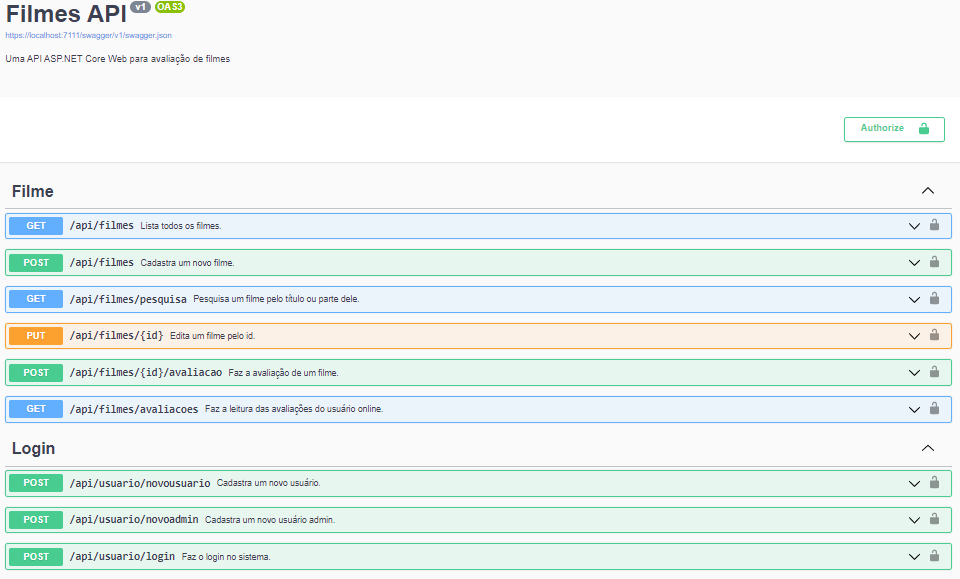

# Filmes_API

A movie API in C# using .Net.

## Description
This is a movie catalog API. You can add a movie, edit informations and search for a movie, but only if you're logged. To do so, it's necessary to sign up.

## Built with
* C#
* .Net 6
* Docker
* Swagger

## Get started
1. Clone the repository and execute using an IDE of your preference.

2. Sign up.

3. Sign in with username and password. Then, copy "Bearer [token]" on "Authorize" button.

4. Now you can add, edit or search for movies.

## Screenshots

## Contact me
LinkedIn: https://www.linkedin.com/in/larissalimaqueiroz/